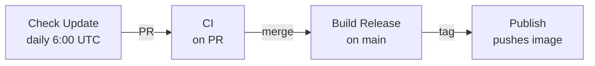

# Workflows

| Workflow | Trigger | Description |
|----------|---------|-------------|
| **Check Update** | Daily at 6:00 UTC | Checks for new BuildKit releases and creates a PR if found |
| **CI** | Pull requests | Builds the image (no push) to verify it works |
| **Build Release** | `BUILDKIT_VERSION` change on main | Creates a git tag matching the BuildKit version |
| **Publish** | `v*` tags | Builds and pushes the image to `ghcr.io/omniproc/act-buildkit-runner` |

## Flow

