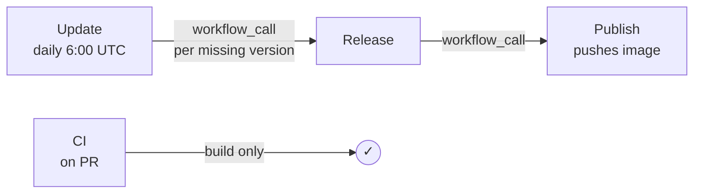

# Workflows

All release workflows are chained via `workflow_call` so that computed state
(like which version is "latest") flows through the pipeline without redundant
API calls or race conditions.

| Workflow    | Trigger                             | Description                                                                   |
| ----------- | ----------------------------------- | ----------------------------------------------------------------------------- |
| **Update**  | Daily at 6:00 UTC / manual dispatch | Detects new BuildKit releases and fans out to Release for each                |
| **Release** | Called by Update / manual dispatch  | Creates a GitHub release and tag for a single BuildKit version                |
| **Publish** | Called by Release / manual dispatch | Builds and pushes the image to `ghcr.io/omniproc/act-buildkit-runner`         |
| **CI**      | Pull requests                       | Builds the image (no push) using the latest release tag to verify builds work |

## Flow

## Key design decisions

- **`workflow_call` chain** — Update computes the highest upstream version once
  and passes it as `latest-version` to Release and Publish. This prevents the
  Docker `latest` tag and the GitHub "Latest" release badge from being assigned
  to the wrong version when multiple releases run in parallel.
- **`make_latest` flag** — Release uses the GitHub API `make_latest` parameter
  so only the highest version gets the "Latest" badge, regardless of creation
  order.
- **Idempotency** — Both Release (checks for existing release) and Publish
  (checks for existing image) are safe to re-run.
- **Manual dispatch** — All three release workflows support `workflow_dispatch`
  for one-off runs. When triggered manually without `latest-version`, the
  Docker `latest` tag and GitHub "Latest" badge default to `false`.
